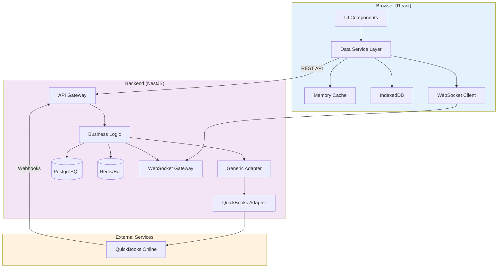
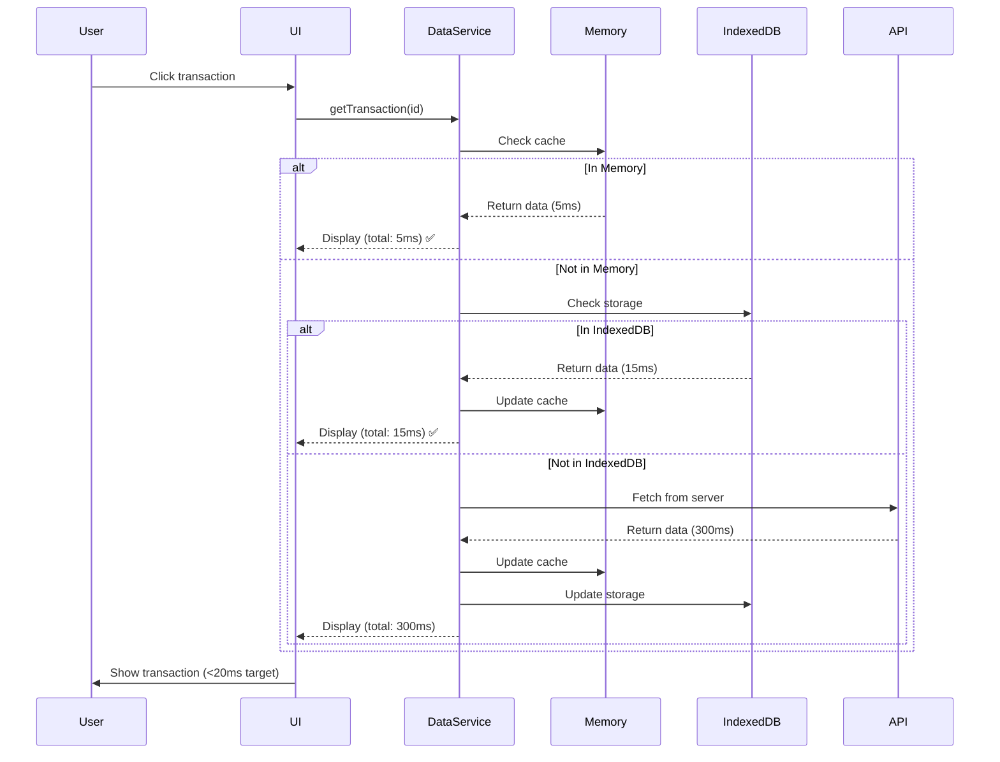
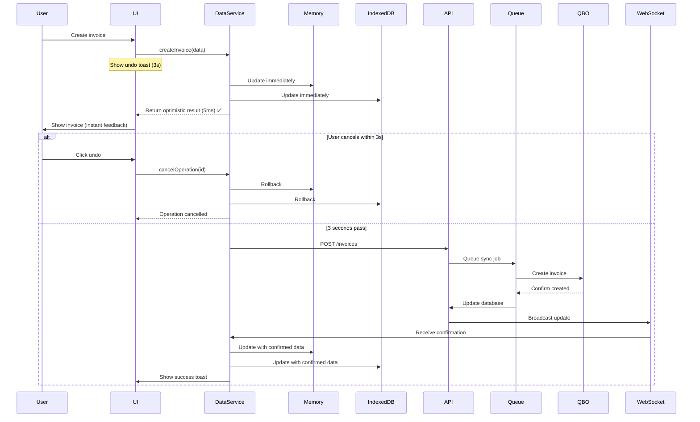
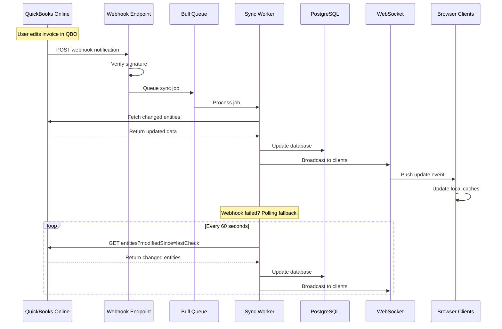
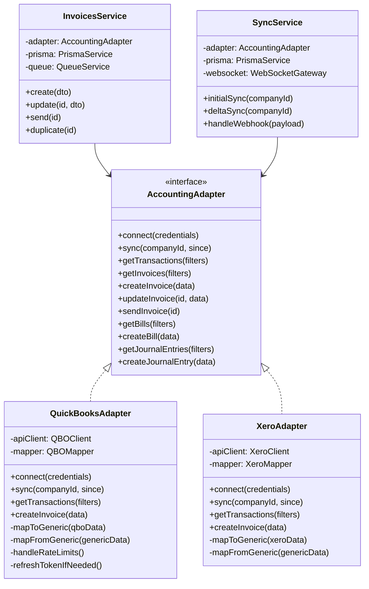
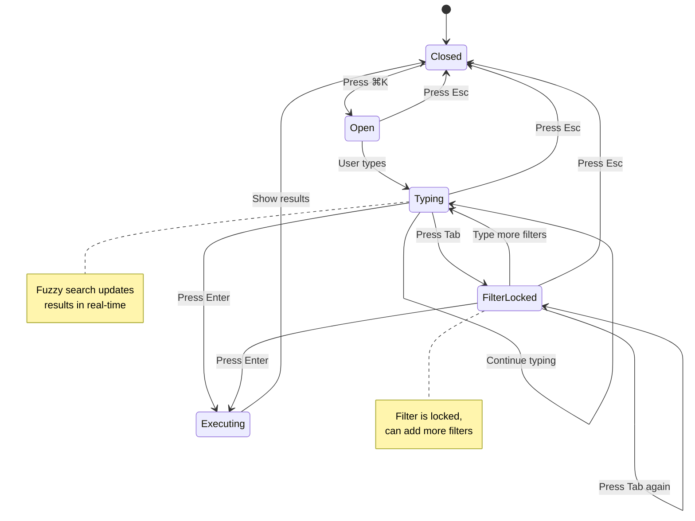
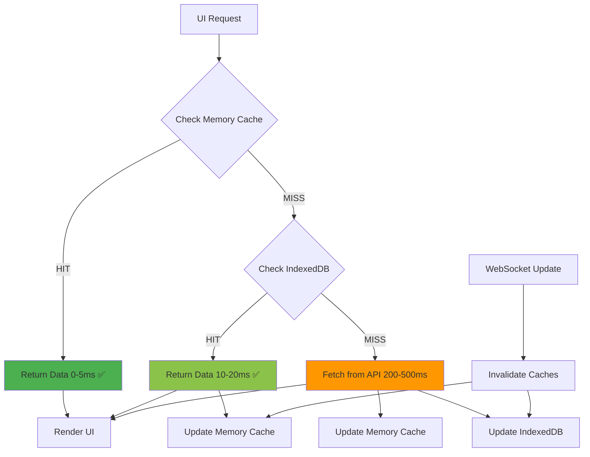
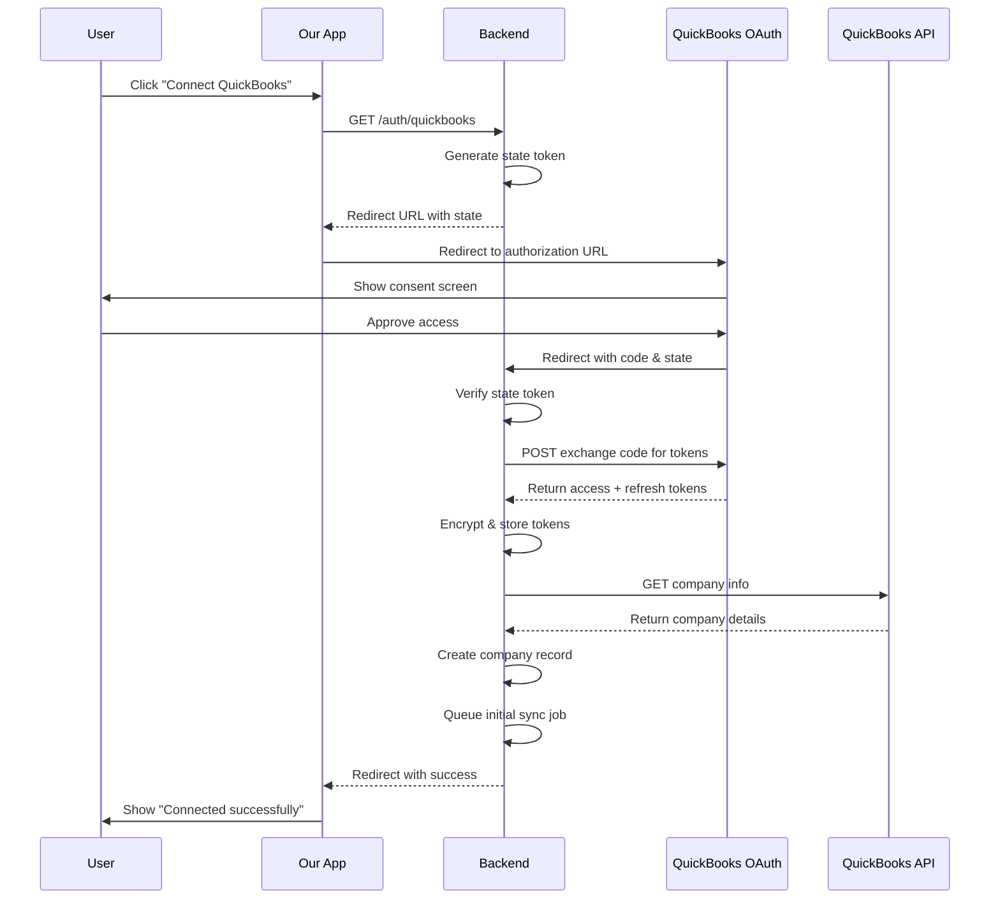
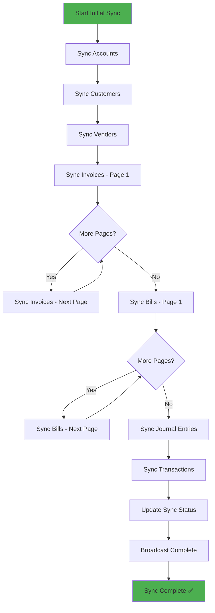
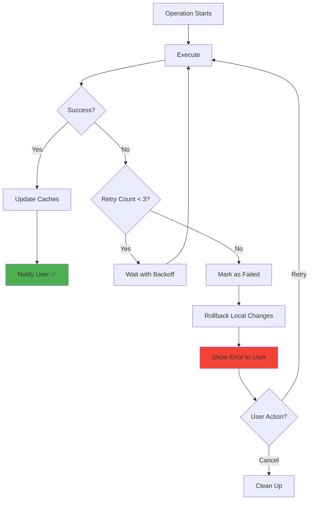

# Superhuman for QuickBooks
## Document 1: Requirements, Architecture & Diagrams

**Version:** 1.0  
**Date:** December 2024  

---

## Table of Contents

1. [Requirements](#1-requirements)
2. [Architecture](#2-architecture)
3. [Mermaid Diagrams](#3-mermaid-diagrams)
4. [Performance Benchmarks](#4-performance-benchmarks)

---

## 1. Requirements

### 1.1 Product Vision

Build a **Superhuman-style productivity interface** for QuickBooks Online that delivers:
- **10x faster** navigation and operations than native QBO UI
- **<20ms UI response time** for all user interactions
- **Keyboard-first** workflow (mouse optional)
- **Local-first** architecture ensuring instant responsiveness
- **Real-time sync** with QuickBooks Online

### 1.2 Core Functional Requirements

#### Must Have (MVP v1)

**1. Authentication & Connection**
- OAuth 2.0 connection to QuickBooks Online
- Multi-company database structure (UI switcher in v2)
- Secure token storage and automatic refresh
- Support for sandbox and production environments

**2. Data Synchronization**
- Initial full sync of all entities (Accounts, Customers, Vendors, Invoices, Bills, Journal Entries, Transactions)
- Delta sync via webhooks + polling fallback (60s)
- Real-time push updates to UI via WebSocket
- Sync status indicators (Syncing, Synced, Failed, Offline)
- Background job queue with retry mechanism

**3. Command Palette (⌘K)**
- Fuzzy search across all entities
- Multi-parameter filter chaining with Tab-to-lock
- Recent query memory (last 10 queries)
- Keyboard-only operation
- Sub-100ms search results for 10K+ records

**4. Transaction Management**
- View all transactions with instant filtering
- Keyboard navigation (j/k or arrow keys)
- Quick edit shortcuts (D=date, E=full edit, M=memo)
- Multi-select with Shift
- Virtual scrolling for large datasets (100K+ transactions)

**5. Invoice Operations**
- Create invoice with line items
- Edit existing invoice
- Duplicate invoice (pre-populated draft)
- Send invoice via QBO API
- Optimistic updates with undo capability

**6. Bill Operations**
- Create bill with line items
- Edit existing bill
- Duplicate bill

**7. Journal Entry Operations**
- Create journal entry with debit/credit lines
- Edit existing journal entry
- Duplicate journal entry
- Validation: debits = credits

**8. Undo Functionality**
- 3-second delay before operation executes
- Cancel button in toast notification
- Rollback local changes if cancelled
- Visual countdown progress bar

**9. Export Capabilities**
- CSV export of any filtered view
- Maintain applied filters in export
- Include all visible columns
- Date-stamped filename

**10. Generic Adapter Layer**
- Abstract accounting provider interface
- QuickBooks adapter implementation
- Extensible for future providers (Xero, Sage, etc.)
- Clean separation of concerns

#### Explicitly Out of Scope (v2+)

- ❌ Reports (P&L, Balance Sheet, A/R Aging, A/P Aging)
- ❌ Multi-company UI switcher
- ❌ Email/password authentication
- ❌ Advanced conflict resolution UI
- ❌ Mobile applications
- ❌ Offline write capabilities
- ❌ Multi-user collaboration features
- ❌ Custom fields
- ❌ Bulk import via CSV
- ❌ Payment processing
- ❌ Time tracking
- ❌ Inventory management

### 1.3 Non-Functional Requirements

**Performance Requirements:**

| Operation | Target | Maximum Acceptable | Measurement Method |
|-----------|--------|-------------------|-------------------|
| UI keypress response | <10ms | 20ms | Time from keydown to DOM update |
| Button click feedback | <10ms | 20ms | Time to visual state change |
| Command palette open | <30ms | 50ms | ⌘K to modal visible |
| Form input typing | <5ms | 10ms | Character appears in input |
| Memory cache read | <5ms | 10ms | Return from Map.get() |
| IndexedDB read | <15ms | 30ms | Single record fetch |
| Search 10K records | <50ms | 100ms | Fuzzy search completion |
| Filter 50K records | <100ms | 200ms | Apply filter predicate |
| Initial page load (FCP) | <1.5s | 2s | First Contentful Paint |
| Transaction list render | <50ms | 100ms | 10K rows virtual scroll |
| Form open to interactive | <100ms | 200ms | Click to ready state |

**Scalability Requirements:**
- Support 100,000+ transactions per company
- Handle 50+ concurrent WebSocket connections
- Sync 10,000 entities in under 30 seconds
- IndexedDB storage: up to 500MB per company
- Memory cache: max 50MB active data

**Reliability Requirements:**
- 99.5% uptime target for production
- Zero data loss during sync operations
- Automatic retry for failed operations (3 attempts)
- Graceful degradation on network issues
- Clear error messages for all failure modes

**Usability Requirements:**
- All core actions accessible via keyboard shortcuts
- Consistent keyboard shortcuts across the application
- Clear visual feedback for all user actions
- Intuitive command palette syntax
- Discoverable features (keyboard shortcuts help: ?)
- Maximum 3 clicks to any common action

**Maintainability Requirements:**
- TypeScript strict mode throughout
- 80%+ code coverage for critical paths
- Comprehensive API documentation (Swagger)
- Clear separation of concerns (Clean Architecture)
- Modular, testable components
- Conventional commit messages

---

## 2. Architecture

### 2.1 High-Level System Architecture

```
┌──────────────────────────────────────────────────────────────────┐
│                     Browser (React Application)                   │
│                                                                   │
│  ┌────────────────────────────────────────────────────────────┐ │
│  │                   UI Components Layer                       │ │
│  │  • Command Palette        • Transaction List                │ │
│  │  • Invoice/Bill Forms     • Status Indicators               │ │
│  │  • Keyboard Shortcuts     • Error Boundaries                │ │
│  └────────────────────────────────────────────────────────────┘ │
│                              ↕                                    │
│  ┌────────────────────────────────────────────────────────────┐ │
│  │              Data Service Layer (Local-First)               │ │
│  │  • In-Memory Cache (instant reads: 0-5ms)                  │ │
│  │  • IndexedDB Cache (persistent: 10-20ms)                   │ │
│  │  • WebSocket Client (real-time updates)                    │ │
│  │  • API Client (REST calls)                                 │ │
│  └────────────────────────────────────────────────────────────┘ │
└──────────────────────────────────────────────────────────────────┘
                              ↕
                   (REST API + WebSocket)
                              ↕
┌──────────────────────────────────────────────────────────────────┐
│                     Backend (NestJS Application)                  │
│                                                                   │
│  ┌────────────────────────────────────────────────────────────┐ │
│  │                    API Gateway Layer                        │ │
│  │  • REST Controllers          • WebSocket Gateway            │ │
│  │  • Authentication Guards     • Rate Limiting                │ │
│  │  • Request Validation        • Error Filters                │ │
│  └────────────────────────────────────────────────────────────┘ │
│                              ↕                                    │
│  ┌────────────────────────────────────────────────────────────┐ │
│  │                  Business Logic Layer                       │ │
│  │  • Generic Adapter Interface                                │ │
│  │  • Sync Service (initial + delta)                          │ │
│  │  • Transaction Service                                      │ │
│  │  • Invoice/Bill/JE Services                                │ │
│  │  • Webhook Handler                                         │ │
│  └────────────────────────────────────────────────────────────┘ │
│                              ↕                                    │
│  ┌────────────────────────────────────────────────────────────┐ │
│  │                   Data Access Layer                         │ │
│  │  • Prisma ORM                                              │ │
│  │  • PostgreSQL Database                                     │ │
│  │  • Bull Queue (Redis-based)                                │ │
│  │  • Redis Cache                                             │ │
│  └────────────────────────────────────────────────────────────┘ │
└──────────────────────────────────────────────────────────────────┘
                              ↕
                   (OAuth 2.0 + REST API)
                              ↕
┌──────────────────────────────────────────────────────────────────┐
│                   QuickBooks Online (QBO)                         │
│  • OAuth Authorization Server                                     │
│  • REST API (Accounting endpoints)                               │
│  • Webhook Notifications                                         │
└──────────────────────────────────────────────────────────────────┘
```

### 2.2 Read Flow Architecture (Local-First)

**Optimized for <20ms Response Time**

```
┌─────────────┐
│ User Action │ (e.g., Click transaction)
└──────┬──────┘
       ↓
┌──────────────────┐
│  UI Component    │
└──────┬───────────┘
       ↓
┌────────────────────────────┐
│ DataService.get(id)        │
└──────┬─────────────────────┘
       ↓
┌────────────────────────────┐
│ Check In-Memory Cache      │
└──────┬─────────────────────┘
       ↓
    HIT? ──Yes──> Return (0-5ms) ✅ INSTANT
       │
       No (MISS)
       ↓
┌────────────────────────────┐
│ Check IndexedDB            │
└──────┬─────────────────────┘
       ↓
    HIT? ──Yes──> Return (10-20ms) ✅ FAST
       │                │
       │                └──> Update Memory Cache
       │
       No (MISS)
       ↓
┌────────────────────────────┐
│ Fetch from Backend API     │
└──────┬─────────────────────┘
       ↓
    Return (200-500ms) ⚠️ SLOWER
       │
       ├──> Update Memory Cache
       └──> Update IndexedDB
```

**Cache Strategy:**
- **Memory Cache (Tier 1):** Recent/active data (last 10K records accessed)
- **IndexedDB (Tier 2):** All synced data (up to 100K records)
- **Backend API (Tier 3):** Full dataset + historical data

**Cache Invalidation Triggers:**
- User creates/updates/deletes entity → Invalidate affected caches
- WebSocket push received → Update caches with new data
- Periodic sync complete → Refresh stale data (>5 minutes old)

### 2.3 Write Flow Architecture (Optimistic Updates)

```
┌─────────────────────┐
│ User Action         │ (e.g., Create Invoice)
└──────┬──────────────┘
       ↓
┌──────────────────────────────────────┐
│ Show Undo Toast (3 seconds)         │
│ "Creating invoice... [UNDO]"         │
└──────┬───────────────────────────────┘
       ↓
┌──────────────────────────────────────┐
│ Update Memory Cache IMMEDIATELY      │ Optimistic
└──────┬───────────────────────────────┘
       ↓
┌──────────────────────────────────────┐
│ Update IndexedDB IMMEDIATELY         │ Optimistic
└──────┬───────────────────────────────┘
       ↓
       UI shows invoice instantly! ✅
       │
       ↓
┌──────────────────────────────────────┐
│ 3-Second Delay Timer                 │
└──────┬───────────────────────────────┘
       ↓
    User Cancels? ──Yes──> ┌──────────────────┐
       │                    │ Rollback Changes │
       │                    │ Remove from Cache│
       │                    └──────────────────┘
       No                              │
       ↓                               ↓
┌────────────────────────┐          Done ✅
│ POST to Backend API    │
└──────┬─────────────────┘
       ↓
┌────────────────────────┐
│ Backend Queues Job     │ (Bull Queue)
└──────┬─────────────────┘
       ↓
┌────────────────────────┐
│ Worker Syncs to QBO    │
└──────┬─────────────────┘
       ↓
    Success? ──Yes──> ┌──────────────────────────┐
       │              │ QBO Returns Confirmed ID │
       │              └──────┬───────────────────┘
       No                    ↓
       ↓              ┌──────────────────────────┐
┌────────────────┐   │ Backend Updates DB       │
│ Mark as Error  │   └──────┬───────────────────┘
│ Show User      │          ↓
└────────────────┘   ┌──────────────────────────┐
                     │ WebSocket Push to Clients│
                     └──────┬───────────────────┘
                            ↓
                     ┌──────────────────────────┐
                     │ All Clients Update Cache │
                     │ with Confirmed Data      │
                     └──────────────────────────┘
                                   ↓
                           Sync Complete ✅
```

**Key Principles:**
1. **Optimistic UI** - Update local state immediately (feels instant)
2. **Undo Window** - 3-second grace period to cancel
3. **Background Sync** - Queue operations asynchronously (no blocking)
4. **Confirmation** - Real-time push when QBO confirms
5. **Rollback** - Revert local changes if sync fails or user cancels

### 2.4 Real-Time Sync Architecture

**Webhook-Driven with Polling Fallback**

```
QuickBooks Online
       │
       │ (User edits invoice in QBO)
       ↓
┌─────────────────────────┐
│ QBO Webhook Notification│
└──────┬──────────────────┘
       ↓
┌────────────────────────────────────┐
│ Backend Webhook Endpoint           │
│ POST /webhooks/quickbooks          │
└──────┬─────────────────────────────┘
       ↓
┌────────────────────────────────────┐
│ Verify Webhook Signature           │
│ (HMAC-SHA256)                      │
└──────┬─────────────────────────────┘
       ↓
    Valid? ──No──> Reject (401)
       │
      Yes
       ↓
┌────────────────────────────────────┐
│ Parse Changed Entity IDs           │
│ (e.g., Invoice #1234)              │
└──────┬─────────────────────────────┘
       ↓
┌────────────────────────────────────┐
│ Queue Sync Job (Bull)              │
│ Job: { entityType, entityId }      │
└──────┬─────────────────────────────┘
       ↓
┌────────────────────────────────────┐
│ Worker Fetches Entity from QBO     │
│ GET /invoice/1234                  │
└──────┬─────────────────────────────┘
       ↓
┌────────────────────────────────────┐
│ Update PostgreSQL                  │
│ UPSERT invoice                     │
└──────┬─────────────────────────────┘
       ↓
┌────────────────────────────────────┐
│ Broadcast via WebSocket            │
│ → All Connected Clients            │
└──────┬─────────────────────────────┘
       ↓
┌────────────────────────────────────┐
│ Clients Update Memory + IndexedDB  │
└────────────────────────────────────┘
              ↓
       User sees update! ✅
```

**Polling Fallback (Webhooks Unreliable):**

```
Every 60 seconds:
    ↓
┌────────────────────────────────────┐
│ Query QBO: modifiedSince=lastCheck│
└──────┬─────────────────────────────┘
       ↓
┌────────────────────────────────────┐
│ Fetch Changed Entities             │
└──────┬─────────────────────────────┘
       ↓
┌────────────────────────────────────┐
│ Update Database                    │
└──────┬─────────────────────────────┘
       ↓
┌────────────────────────────────────┐
│ Broadcast to Clients               │
└────────────────────────────────────┘
```

### 2.5 Generic Adapter Architecture (Multi-Provider)

**Design for Future Extensibility**

```
┌───────────────────────────────────────────────┐
│        Application Business Logic             │
│  (Invoices Service, Sync Service, etc.)       │
└───────────────────┬───────────────────────────┘
                    ↓
┌───────────────────────────────────────────────┐
│     Generic AccountingAdapter Interface       │
│                                                │
│  Methods:                                      │
│  • connect(credentials): Promise<void>        │
│  • sync(companyId, since?): Promise<void>     │
│  • getTransactions(filters): Promise<T[]>     │
│  • getInvoices(filters): Promise<Invoice[]>   │
│  • createInvoice(data): Promise<Invoice>      │
│  • updateInvoice(id, data): Promise<Invoice>  │
│  • sendInvoice(id): Promise<void>             │
│  • etc...                                      │
└───────────────────┬───────────────────────────┘
                    ↓
        ┌───────────┴───────────┐
        ↓                       ↓
┌──────────────────┐    ┌──────────────────┐
│ QBO Adapter      │    │ Xero Adapter     │
│ (MVP v1)         │    │ (Future v2)      │
│                  │    │                  │
│ • mapToGeneric() │    │ • mapToGeneric() │
│ • mapFromGeneric()│   │ • mapFromGeneric()│
│ • handleAuth()   │    │ • handleAuth()   │
└────────┬─────────┘    └────────┬─────────┘
         ↓                       ↓
┌──────────────────┐    ┌──────────────────┐
│ QuickBooks API   │    │ Xero API         │
│ (Intuit)         │    │                  │
└──────────────────┘    └──────────────────┘
```

**Adapter Interface (TypeScript):**

```typescript
export interface AccountingAdapter {
  // Provider info
  readonly providerName: string
  readonly version: string
  
  // Connection & Authentication
  connect(credentials: OAuthCredentials): Promise<ConnectionResult>
  disconnect(companyId: string): Promise<void>
  refreshToken(companyId: string): Promise<void>
  isConnected(companyId: string): Promise<boolean>
  
  // Sync Operations
  initialSync(companyId: string): Promise<SyncResult>
  deltaSync(companyId: string, since: Date): Promise<SyncResult>
  getSyncStatus(companyId: string): Promise<SyncStatus>
  
  // Read Operations - Chart of Accounts
  getAccounts(companyId: string, filters?: AccountFilters): Promise<Account[]>
  getAccount(companyId: string, id: string): Promise<Account>
  
  // Read Operations - Entities
  getCustomers(companyId: string, filters?: EntityFilters): Promise<Customer[]>
  getCustomer(companyId: string, id: string): Promise<Customer>
  getVendors(companyId: string, filters?: EntityFilters): Promise<Vendor[]>
  getVendor(companyId: string, id: string): Promise<Vendor>
  
  // Read Operations - Transactions
  getTransactions(companyId: string, filters?: TransactionFilters): Promise<Transaction[]>
  getInvoices(companyId: string, filters?: InvoiceFilters): Promise<Invoice[]>
  getInvoice(companyId: string, id: string): Promise<Invoice>
  getBills(companyId: string, filters?: BillFilters): Promise<Bill[]>
  getBill(companyId: string, id: string): Promise<Bill>
  getJournalEntries(companyId: string, filters?: JEFilters): Promise<JournalEntry[]>
  getJournalEntry(companyId: string, id: string): Promise<JournalEntry>
  
  // Write Operations - Invoices
  createInvoice(companyId: string, data: CreateInvoiceDto): Promise<Invoice>
  updateInvoice(companyId: string, id: string, data: UpdateInvoiceDto): Promise<Invoice>
  deleteInvoice(companyId: string, id: string): Promise<void>
  sendInvoice(companyId: string, id: string, emailTo?: string): Promise<void>
  
  // Write Operations - Bills
  createBill(companyId: string, data: CreateBillDto): Promise<Bill>
  updateBill(companyId: string, id: string, data: UpdateBillDto): Promise<Bill>
  deleteBill(companyId: string, id: string): Promise<void>
  
  // Write Operations - Journal Entries
  createJournalEntry(companyId: string, data: CreateJournalEntryDto): Promise<JournalEntry>
  updateJournalEntry(companyId: string, id: string, data: UpdateJournalEntryDto): Promise<JournalEntry>
  deleteJournalEntry(companyId: string, id: string): Promise<void>
  
  // Webhooks
  setupWebhook(companyId: string, webhookUrl: string): Promise<void>
  verifyWebhook(payload: any, signature: string): boolean
  parseWebhookEvent(payload: any): WebhookEvent[]
}
```

**Benefits of Generic Adapter:**
1. **Single Business Logic** - Write once, works with any provider
2. **Easy Testing** - Mock adapter for unit tests
3. **Future-Proof** - Add Xero, Sage, etc. without changing business logic
4. **Provider Switching** - Users can migrate between platforms
5. **Feature Parity** - Ensure consistent experience across providers

---

## 3. Mermaid Diagrams

### 3.1 System Architecture Diagram



### 3.2 Read Flow Sequence Diagram



### 3.3 Write Flow Sequence Diagram (Optimistic Update)



### 3.4 Sync Flow Diagram (Webhook + Polling)



### 3.5 Generic Adapter Class Diagram



### 3.6 Command Palette State Machine



### 3.7 Data Cache Hierarchy



### 3.8 OAuth Flow Diagram



### 3.9 Initial Sync Flow



### 3.10 Error Recovery Flow



---

## 4. Performance Benchmarks & Targets

### 4.1 Critical Performance Metrics

| Category | Metric | Target | Maximum | Measurement Point |
|----------|--------|--------|---------|-------------------|
| **UI Interactions** |
| Keypress response | <10ms | 20ms | keydown to DOM update |
| Button click | <10ms | 20ms | click to visual change |
| Form input typing | <5ms | 10ms | character appears |
| Command palette open | <30ms | 50ms | ⌘K to visible |
| **Data Operations** |
| Memory cache read | <5ms | 10ms | Map.get() |
| IndexedDB read | <15ms | 30ms | Single record |
| IndexedDB bulk read | <50ms | 100ms | 1000 records |
| Fuzzy search 10K | <50ms | 100ms | Results ready |
| Filter 50K records | <100ms | 200ms | Predicate applied |
| **Network** |
| API call p50 | <200ms | 500ms | Round trip |
| API call p95 | <500ms | 1000ms | Round trip |
| WebSocket message | <50ms | 100ms | Receive to process |
| **Rendering** |
| Initial load (FCP) | <1.5s | 2s | First paint |
| Initial load (TTI) | <3s | 5s | Interactive |
| Virtual list render | <50ms | 100ms | 10K rows |
| Form open | <100ms | 200ms | Click to ready |
| Modal open | <50ms | 100ms | Click to visible |
| **Sync Operations** |
| Webhook processing | <200ms | 500ms | Receive to DB |
| Initial sync 10K | <30s | 60s | Full completion |
| Delta sync | <5s | 10s | Per batch |

### 4.2 Load Testing Targets

**Concurrent Users:**
- 10 users: <50ms p95 response
- 50 users: <100ms p95 response
- 100 users: <200ms p95 response

**Data Volume:**
- 10K transactions: <100ms search
- 50K transactions: <200ms search
- 100K transactions: <500ms search

**WebSocket Connections:**
- 50 connections: <100ms broadcast
- 100 connections: <200ms broadcast
- 500 connections: <500ms broadcast

### 4.3 Resource Constraints

**Frontend (Browser):**
```
Memory Usage:
- Memory cache: Max 50MB
- IndexedDB: Max 500MB
- Total heap: <200MB

CPU Usage:
- Idle: <5%
- During search: <30%
- During sync: <20%

Network:
- WebSocket: Persistent
- API calls: Max 10 concurrent
- Reconnect: Exponential backoff
```

**Backend (per instance):**
```
Memory Usage:
- Node heap: <512MB
- Redis: <100MB

CPU Usage:
- Idle: <10%
- During sync: <50%
- Peak load: <80%

Database:
- Connections: Max 20
- Query p90: <100ms
- Index all FKs + dates
```

### 4.4 Performance Monitoring Setup

**Client-Side Metrics (track these):**
```javascript
// Core Web Vitals
- LCP (Largest Contentful Paint): <2.5s
- FID (First Input Delay): <100ms
- CLS (Cumulative Layout Shift): <0.1

// Custom Metrics
performance.mark('search-start')
// ... search executes
performance.mark('search-end')
performance.measure('search-duration', 'search-start', 'search-end')

// Report if > threshold
if (duration > 100) {
  analytics.track('slow_search', { duration, filters })
}
```

**Server-Side Metrics:**
```typescript
// Track all API endpoints
app.use((req, res, next) => {
  const start = Date.now()
  res.on('finish', () => {
    const duration = Date.now() - start
    metrics.histogram('api.response_time', duration, {
      endpoint: req.path,
      method: req.method
    })
  })
  next()
})
```

### 4.5 Performance Testing Strategy

**Load Test Script Example:**
```javascript
// k6 load test
import http from 'k6/http'
import { check, sleep } from 'k6'

export const options = {
  stages: [
    { duration: '2m', target: 10 },  // Ramp to 10 users
    { duration: '5m', target: 50 },  // Ramp to 50 users
    { duration: '2m', target: 0 },   // Ramp down
  ],
  thresholds: {
    http_req_duration: ['p(95)<200'], // 95% under 200ms
    http_req_failed: ['rate<0.01'],   // <1% errors
  },
}

export default function () {
  const res = http.get('https://api.yourapp.com/transactions?companyId=test')
  
  check(res, {
    'status is 200': (r) => r.status === 200,
    'response time < 200ms': (r) => r.timings.duration < 200,
  })
  
  sleep(1)
}
```

---

**END OF DOCUMENT 1**

Next Documents:
- Document 2: Data Models & API Specifications
- Document 3: UI Guidelines & Coding Structure
- Document 4: Security, Sync Strategy & Caching
- Document 5: Development Setup, Testing & Deployment
- Document 6: Implementation Plan & Use Cases
